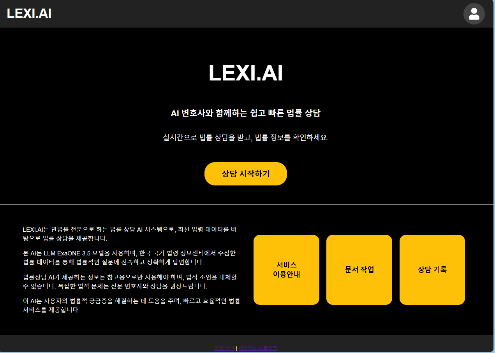
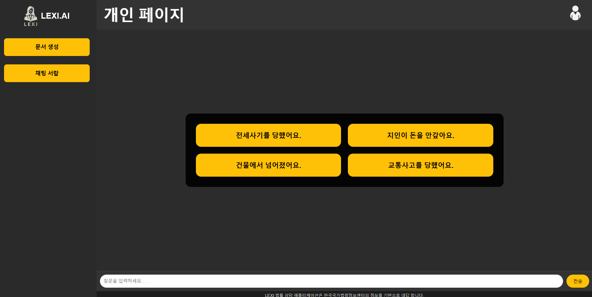
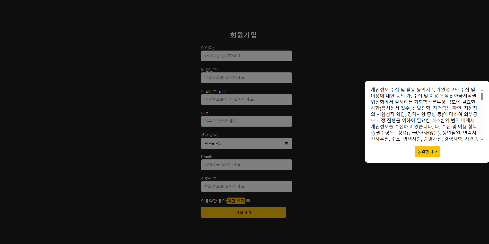

# ** LEXI.AI - Ai 법률 상담 채팅 웹 어플리케이션**  

> **AiLawyer**는 LLM 기반의 법률 상담 챗봇으로, 사용자가 법적 문제에 대한 질문을 하면 적절한 법률 조항과 판례를 바탕으로 답변을 제공하는 웹 애플리케이션입니다.

# 프로젝트 개요  
**LEXI_AI-main**(AI 모델)과 **Lawyer-ai**(웹 애플리케이션) 두 개의 주요 구성 요소로 이루어져 있습니다.  

- **LEXI_AI-main**: 파이썬 기반의 법률 AI 모델을 개발 및 학습하는 프로젝트(https://github.com/JUYEON919/AiLawyer_Python.git)  
- **Lawyer-ai**: 자바(Spring Boot) 기반의 백엔드와 React 프론트엔드로 구성된 웹 애플리케이션
- Lawyer-ai는 LEXI_AI-main의 AI 모델을 API를 통해 호출하여 법률 상담 기능을 제공합니다.  

각 구성 요소는 별도의 환경에서 실행되지만, AI 모델과 웹 애플리케이션이 서로 연동됩니다.  

# **시현영상**
https://drive.google.com/file/d/17etBn3a9qLnQ5s8PLZ6d-zagn78EAKvd/view?usp=sharing

# ** UI 및 기능 업데이트 예정
---
# 주요기능화면 (V_01)
  
  
  

---

## 🛠 Development Environment  

### 🌐 Frontend  
- **HTML/CSS**: 웹페이지 구조 및 스타일링  
- **JavaScript**: 동적 기능 및 클라이언트 측 로직 구현  
- **React**: 컴포넌트 기반 UI/UX 구현  

### 🖥 Backend  
- **Spring Boot 3.0+**: 웹 프레임워크  
- **Java (JDK 17)**: 비즈니스 로직 구현  
- **Python 3.12.8**: 머신러닝 및 딥러닝 예측 모델 구현  
- **FastAPI 3.10.6**: AI 모델 호출 및 결과 제공 (RESTful API)  

### 🤖 AI & LLM  
- **Exaone 3.5**: 대규모 언어 모델을 통한 AI 서비스  

### 🗄 Database  
- **MariaDB / MySQL (10.6)**: 데이터 저장소 (RDBMS)  
- **MyBatis 3.5.9**: 데이터베이스 연동 및 쿼리 처리  

---

---
## ⚠️ 주의할점

- 프로젝트 실행 전, `data` 폴더 위치설정, 폴더 내 데이터 파일이 존재하는지 확인하세요.
- 프로젝트 실행 시, 현재 경로를 프로젝트의 루트 디렉토리로 설정해야 합니다.
- 일부 머신러닝 모델 학습에는 **수 분**이 소요될 수 있습니다.

